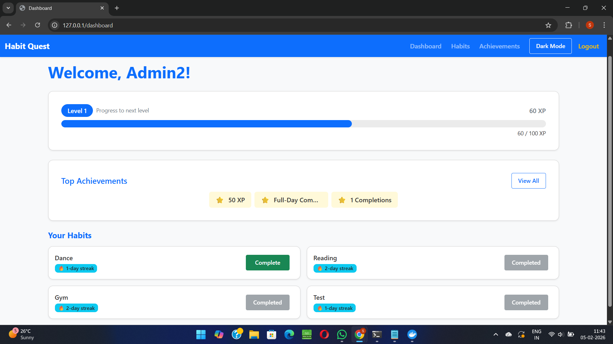
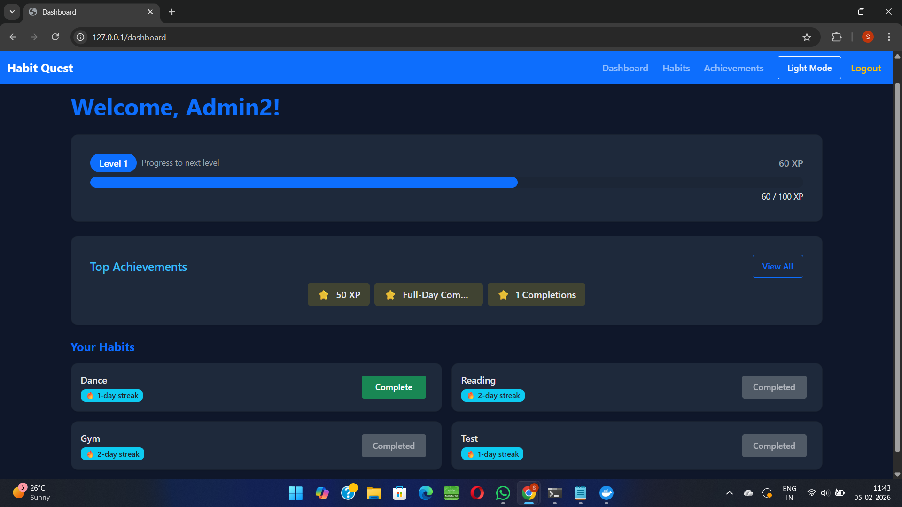
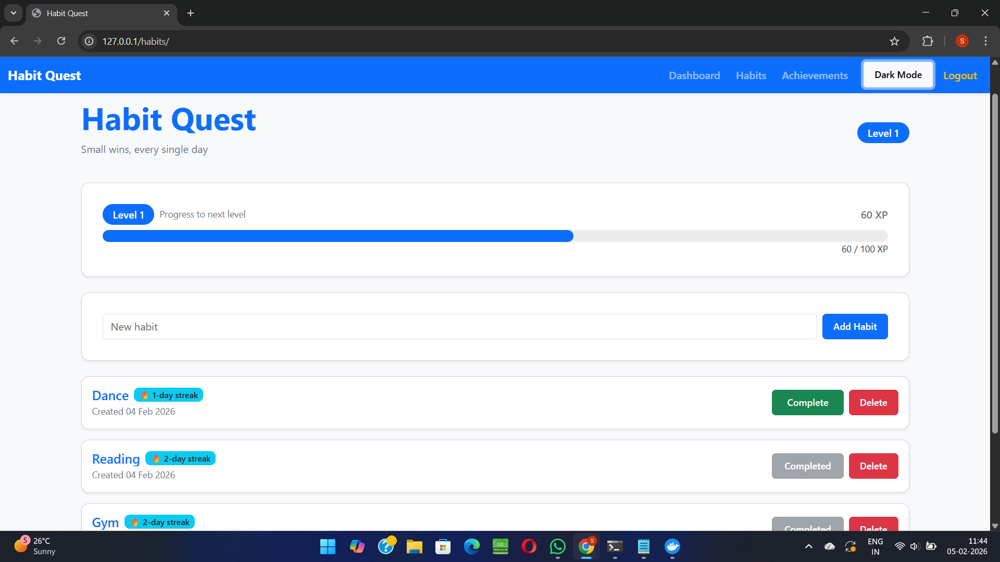
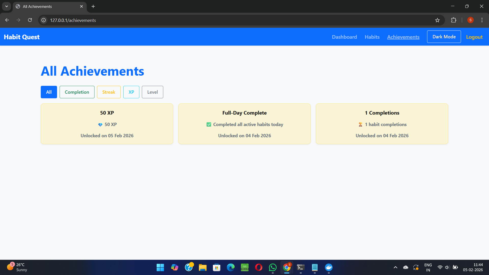
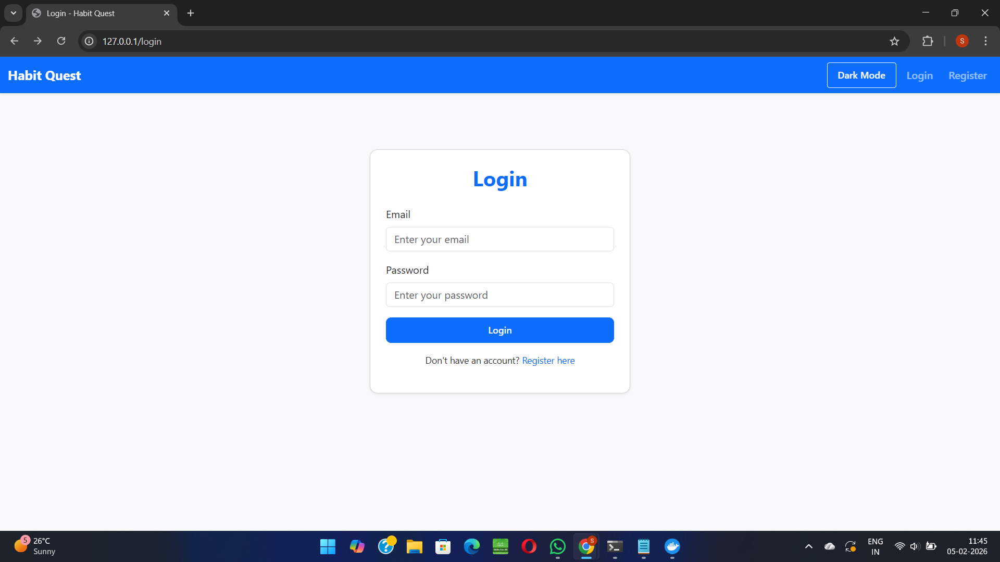

# Habit Quest 🧠🎮

Habit Quest is a **production-style, containerized Flask application** designed and built as a **cloud / DevOps–focused portfolio project**.
It demonstrates how a modern web app is **designed, containerized, configured, and prepared for deployment** using real-world tooling and practices.

The project intentionally goes beyond CRUD by combining **gamification logic**, **stateful data**, and a **multi-container architecture** that mirrors how applications are deployed in cloud environments.

---

## 🚀 Why This Project (DevOps Perspective)

This project was built to showcase skills relevant to **Cloud / DevOps / Platform roles**, including:

* Designing a **12-factor style application**
* Running Flask behind **Gunicorn (WSGI)**
* Using **Nginx as a reverse proxy**
* Orchestrating services with **Docker Compose**
* Managing **environment-based configuration**
* Working with **stateful services (PostgreSQL)**
* Preparing the app for **CI/CD and EC2-style deployments**

This is not a tutorial app — it is structured like a **real deployable service**.

---

## 🧱 Architecture Overview

```
Client (Browser)
   ↓
Nginx (Reverse Proxy)
   ↓
Gunicorn (WSGI Server)
   ↓
Flask Application
   ↓
PostgreSQL Database
```

**Key architectural decisions:**

* Flask does **not** run with the development server in production
* Gunicorn handles application workers
* Nginx manages HTTP traffic and proxying
* PostgreSQL runs in its own container with persistent volumes

---

## 🐳 Containers & Services

| Service | Purpose                       |
| ------- | ----------------------------- |
| `web`   | Flask app served via Gunicorn |
| `nginx` | Reverse proxy & entry point   |
| `db`    | PostgreSQL database           |

All services are orchestrated using **Docker Compose**.

---

## 🎮 Application Features (Brief)

### Core

* Gamified habit tracking
* XP, levels, streaks, achievements
* Dark mode UI

### Authentication

* Secure login & registration
* Password hashing
* Session-based auth

### Data Layer

* PostgreSQL + SQLAlchemy ORM
* Relational models & constraints
* Migration-ready schema

---

## 🖼 Application Screenshots

The UI is fully responsive, supports dark mode, and is rendered using server-side templates (Jinja),
keeping the frontend lightweight while remaining production-friendly and easy to deploy.


### Dashboard (Light Mode)


### Dashboard (Dark Mode)


### Habits Page


### Achievements Page


### Authentication (Login & Register)



---

## ▶️ Running Locally (Docker)

### Prerequisites

* Docker
* Docker Compose

### Setup

```bash
git clone https://github.com/Shriniwas-Mudliyar/habit-quest.git
cd habit-quest
cp .env.example .env
```
### Start the Application

```bash
docker-compose up --build
```

The application will be available at:

* http://localhost (served via Nginx)
  
### Database Initialization (First Run)
On the first run, the database schema must be initialized manually.
This mirrors how production systems bootstrap schema state and keeps migrations explicit.

In a separate terminal:
```bash
docker-compose exec web bash

export FLASK_APP=app
export FLASK_ENV=development

rm -rf migrations
flask db init
flask db migrate -m "baseline schema"
flask db upgrade
```
This is a one-time setup step required when running the project for the first time
or after resetting the database volume.

### Stopping the Application

```bash
docker-compose down
```
---

## ⚙️ Environment Configuration

Configuration is handled via environment variables:

* `DATABASE_URL`
* `SECRET_KEY`
* `FLASK_ENV`

No secrets are hardcoded in the application.

---

## 📦 Database

* PostgreSQL 16
* Persistent volume for data
* Relational schema with foreign keys

Seed data can be loaded for demo/testing purposes.

---

## 🔄 CI/CD (Planned)

The project is designed to support CI/CD and cloud deployment.

Planned additions:

* GitHub Actions CI
* Docker image build & validation
* EC2 deployment workflow
* Nginx + Gunicorn production tuning

---

## ☁️ Cloud Deployment (Planned)

Target environment:

* AWS EC2
* Docker-based deployment
* Nginx as public entry point

---

## 🧠 Key Takeaway

Habit Quest demonstrates how to:

* Take a Flask app **from local development to production-style deployment**
* Structure a project with **real DevOps constraints in mind**
* Combine backend logic with infrastructure fundamentals

This repository is intentionally built as a **cloud-ready portfolio project**, not just a feature demo.


